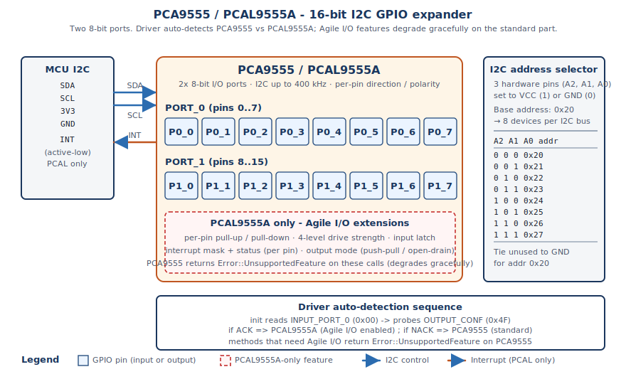

# Hardware Setup



This guide covers the physical connections and hardware requirements for the **PCA9555** and **PCAL9555A** chips. Both are pin-compatible -- the same wiring works for either variant. The driver auto-detects which chip is connected.

## Pin Connections

### Basic I2C Connections

```
MCU              PCA9555 / PCAL9555A
──────────────────────────────────
3.3V      ────── VDD
GND       ────── GND
SCL       ────── SCL (with 4.7kΩ pull-up to 3.3V)
SDA       ────── SDA (with 4.7kΩ pull-up to 3.3V)
```

### Pin Descriptions

| Pin | Name | Description | Required |
|-----|------|-------------|----------|
| VDD | Power | 1.65V to 5.5V power supply (typically 3.3V) | Yes |
| GND | Ground | Ground reference | Yes |
| SCL | Clock | I2C clock line | Yes |
| SDA | Data | I2C data line | Yes |
| A0-A2 | Address | I2C address selection pins | No (for single device) |
| INT | Interrupt | Interrupt output (optional) | No |
| RESET | Reset | Hardware reset (optional) | No |

### GPIO Pins

The PCA9555 / PCAL9555A provides 16 GPIO pins organized into two ports:

- **PORT_0**: Pins 0-7 (P0.0 through P0.7)
- **PORT_1**: Pins 8-15 (P1.0 through P1.7)

Each pin can be configured as:
- Input or output (PCA9555 + PCAL9555A)
- With or without pull-up/pull-down resistor (PCAL9555A only)
- Push-pull or open-drain output per port (PCAL9555A only)
- Interrupt enabled or disabled (PCAL9555A only; software callbacks work on both)

## Power Requirements

- **Supply Voltage**: 1.65V to 5.5V (3.3V typical)
- **Current Consumption**: 
  - Active: ~100 µA typical
  - Standby: < 1 µA
- **Power Supply**: Stable, low-noise supply recommended
- **Decoupling**: 100 nF ceramic capacitor close to VDD pin recommended

## I2C Configuration

### Address Configuration

The I/O expander I2C address is determined by pins A0-A2:

| A2 | A1 | A0 | I2C Address (7-bit) |
|----|----|----|---------------------|
| 0  | 0  | 0  | 0x20 (default) |
| 0  | 0  | 1  | 0x21 |
| 0  | 1  | 0  | 0x22 |
| 0  | 1  | 1  | 0x23 |
| 1  | 0  | 0  | 0x24 |
| 1  | 0  | 1  | 0x25 |
| 1  | 1  | 0  | 0x26 |
| 1  | 1  | 1  | 0x27 |

**Default**: All address pins to GND = **0x20** (used in examples)

### I2C Bus Configuration

- **Speed**: Up to 400 kHz (Fast Mode)
  - Standard Mode: 100 kHz
  - Fast Mode: 400 kHz (most common)
- **Pull-up Resistors**: 4.7 kΩ on SCL and SDA (required for I2C)
- **Bus Voltage**: Must match VDD (typically 3.3V)

## Physical Layout Recommendations

- **Trace Length**: Keep I2C traces short (< 10 cm recommended)
- **Ground Plane**: Use a ground plane for noise reduction
- **Decoupling**: Place 100 nF ceramic capacitor within 1 cm of VDD pin
- **Routing**: Route clock and data lines away from noise sources
- **Multiple Devices**: When using multiple expanders, use proper bus termination

## Example Wiring Diagram

### Single Device

```
                PCA9555 / PCAL9555A
                    ┌─────────┐
        3.3V ───────┤ VDD     │
        GND  ───────┤ GND     │
        SCL  ───────┤ SCL     │─── 4.7kΩ ─── 3.3V
        SDA  ───────┤ SDA     │─── 4.7kΩ ─── 3.3V
                    │         │
                    │ P0.0-7  │─── GPIO pins (PORT_0)
                    │ P1.0-7  │─── GPIO pins (PORT_1)
                    └─────────┘
```

### Multiple Devices

```
MCU SCL ──┬─── Device #1 (A0=0, Addr=0x20) SCL
          │
          └─── Device #2 (A0=1, Addr=0x21) SCL

MCU SDA ──┬─── Device #1 SDA
          │
          └─── Device #2 SDA
```

> **Note**: You can mix PCA9555 and PCAL9555A devices on the same I2C bus. Each driver
> instance auto-detects its chip variant independently.

## Interrupt Pin (Optional)

The INT pin provides hardware interrupt notification:

- **Type**: Open-drain output
- **Requires**: External pull-up resistor (typically 10kΩ to 3.3V)
- **Usage**: Connect to a GPIO input on your MCU for interrupt-driven I/O

## Reset Pin (Optional)

The RESET pin provides hardware reset:

- **Type**: Active-low input
- **Usage**: Connect to MCU GPIO for software reset capability
- **Default**: Leave floating (internal pull-up enables device)

## Next Steps

- Verify connections with a multimeter
- Use an I2C scanner to verify device detection at expected address
- Proceed to [Quick Start](quickstart.md) to test the connection
- Review [Platform Integration](platform_integration.md) for software setup

---

**Navigation**
⬅️ [Quick Start](quickstart.md) | [Next: Platform Integration ➡️](platform_integration.md) | [Back to Index](index.md)

